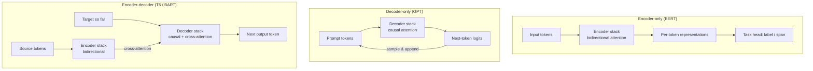

# Architecture Variants: Encoder-Only, Decoder-Only, Encoder-Decoder

> **TL;DR:** The original transformer had an encoder and a decoder; the field then split it apart. Encoder-only models (BERT) see the whole input bidirectionally and excel at *understanding*; decoder-only models (GPT) see only the past and are built for *generation*; encoder-decoder models (T5, BART) keep both halves for *input→output transformation*. Pick the family by asking what the output is.

---

## Overview

"Transformer" names a component kit, not a single model. This lesson maps the three ways the kit gets assembled, ties each layout to its pretraining objective and its natural tasks, and shows how each family looks in Hugging Face code. Knowing which family a model belongs to tells you most of what it can and cannot do before you read a single benchmark.

**By the end, you will be able to:**
- Describe the attention pattern, pretraining objective, and task profile of each of the three transformer families.
- Choose the right family for a given task and justify the choice.
- Load and run a representative model from each family with the Hugging Face `Auto*` classes.

---

## Intuition

Three ways to engage with a book:

- **Encoder-only is the editor.** She reads the whole manuscript — forwards and backwards, flipping between chapters — to form a judgment about every sentence in full context. She produces *annotations*, not new chapters.
- **Decoder-only is the storyteller.** He improvises the tale one word at a time; he can only build on what he has already said. Everything he does — answering, translating, summarizing — is expressed as *continuing the text*.
- **Encoder-decoder is the translator.** She first reads the entire source page (editor mode), then writes a fresh page in the target language word by word (storyteller mode), glancing back at the source as she writes.

The single technical lever distinguishing them is **what each position is allowed to attend to**: everything (bidirectional), only the past (causal), or both patterns wired in sequence.

---

## Details

### Encoder-only: the BERT family

**Attention:** bidirectional — every token attends to every other token. This makes representations rich but generation impossible: the model has no notion of "next token" because it was never restricted to left-to-right context.

**Pretraining:** BERT (Devlin et al., 2018) used **masked language modeling (MLM)** — randomly mask about 15% of input tokens and predict them from both sides:

$$\mathcal{L}_{\text{MLM}} = -\sum_{i \in M} \log P_\theta\!\left(x_i \mid x_{\setminus M}\right)$$

where $M$ is the set of masked positions and $x_{\setminus M}$ the corrupted input. Original BERT added a second objective, **next-sentence prediction (NSP)** — classify whether sentence B actually followed sentence A in the corpus; several successors dropped or replaced NSP.

**Good at:** classification, named-entity recognition, extractive question answering, sentence embeddings — any task whose output is a label or a span, not free text. **Cannot generate.**

### Decoder-only: the GPT family

**Attention:** causal — position $t$ attends only to positions $\le t$, enforced by a triangular mask.

**Pretraining:** **causal language modeling (CLM)** — plain next-token prediction over raw text, introduced for transfer learning in GPT-1 ("Improving Language Understanding by Generative Pre-Training", Radford et al., 2018):

$$\mathcal{L}_{\text{CLM}} = -\sum_{t} \log P_\theta\!\left(x_t \mid x_{<t}\right)$$

**Good at:** generation, by construction — and at scale, **in-context learning**: steering behavior with instructions and examples in the prompt rather than gradient updates. This is now the dominant design for general-purpose LLMs.

### Encoder-decoder: T5 and BART

**Attention:** the full original layout from "Attention Is All You Need" — a bidirectional encoder reads the input; a causal decoder generates the output while **cross-attending** to the encoder's states.

**Pretraining:** denoising objectives. **T5** (Raffel et al., 2019) uses **span corruption** — replace contiguous input spans with sentinel tokens and train the decoder to produce the missing spans. T5's larger contribution is its **text-to-text framing**: *every* task — translation, classification, regression, QA — is cast as text in, text out, with a task prefix in the input (e.g. `"translate English to German: ..."`) and the answer emitted as a string. **BART** (Lewis et al., 2019) corrupts text more aggressively (span deletion/infilling, sentence shuffling) and trains the model to reconstruct the original.

**Good at:** tasks with a clear input→output transformation — translation, summarization, structured rewriting — where an explicit encoding of the full source is natural.

### Decision table

| Your task | Output shape | Family | Typical models |
|---|---|---|---|
| Sentiment / topic classification | label | Encoder-only | BERT, RoBERTa |
| Named-entity recognition | per-token labels | Encoder-only | BERT-family |
| Extractive QA | span of the input | Encoder-only | BERT-family |
| Semantic search embeddings | vector | Encoder-only | BERT-derived encoders |
| Open-ended generation, chat, code | free text | Decoder-only | GPT family, modern LLMs |
| Few-shot / instruction-driven anything | free text | Decoder-only | modern LLMs |
| Translation | transformed text | Encoder-decoder | T5, Marian-style NMT |
| Summarization | transformed text | Encoder-decoder (or LLM) | BART, T5 |

### Pretraining objectives at a glance

| | MLM (BERT) | CLM (GPT) | Span corruption / denoising (T5 / BART) |
|---|---|---|---|
| Corrupt input? | Mask ~15% of tokens | No | Drop/mask spans, shuffle |
| Predict | Masked tokens | Next token | Missing spans / original text |
| Context seen | Both directions | Left only | Encoder: both; decoder: left |
| Native output | Representations | Text | Text |

### Why decoder-only won for general LLMs

The dominance of decoder-only designs for frontier LLMs is best read as an engineering outcome, not a theorem:

- **Simplicity** — one stack, one attention pattern, one objective; less to tune and less to break at scale.
- **A unified interface** — if every task is "continue this text", then one model serves chat, code, extraction, and translation without task-specific heads; instructions replace fine-tuned variants.
- **Training efficiency of CLM** — every position of every sequence is a supervised prediction, so no tokens are "wasted" on corruption bookkeeping, and raw web text needs no preprocessing into input/output pairs.

Encoder-only and encoder-decoder models remain widely used where they fit — lightweight encoders still power much of production classification and retrieval because they are small, fast, and cheap to fine-tune.

### The three families in Hugging Face code

One `Auto*` class per family; the class name tells you the head that gets attached.

```python
# Encoder-only: BERT produces representations, not text.
import torch
from transformers import AutoTokenizer, AutoModel

tok = AutoTokenizer.from_pretrained("bert-base-uncased")
model = AutoModel.from_pretrained("bert-base-uncased")
inputs = tok("Transformers come in three layouts.", return_tensors="pt")
with torch.no_grad():
    out = model(**inputs)
print(out.last_hidden_state.shape)  # (1, seq_len, 768) — one vector per token
```

```python
# Decoder-only: GPT-2 continues text.
from transformers import AutoTokenizer, AutoModelForCausalLM

tok = AutoTokenizer.from_pretrained("gpt2")
model = AutoModelForCausalLM.from_pretrained("gpt2")
ids = tok("The three transformer families are", return_tensors="pt")
out = model.generate(**ids, max_new_tokens=20, do_sample=False)
print(tok.decode(out[0], skip_special_tokens=True))
```

```python
# Encoder-decoder: T5 maps input text to output text, task given as a prefix.
from transformers import AutoTokenizer, AutoModelForSeq2SeqLM

tok = AutoTokenizer.from_pretrained("t5-small")
model = AutoModelForSeq2SeqLM.from_pretrained("t5-small")
ids = tok("translate English to German: The book is on the table.",
          return_tensors="pt")
out = model.generate(**ids, max_new_tokens=20)
print(tok.decode(out[0], skip_special_tokens=True))
```

## Diagram



## Worked Example

Task: **route customer-support emails to one of 12 departments**, 50k labeled examples, latency budget of a few milliseconds per email.

1. **Output shape?** A label. That points at encoder-only.
2. **Fit:** fine-tune a BERT-family model with a classification head (`AutoModelForSequenceClassification`, `num_labels=12`). The bidirectional encoder reads each email in full context; the head maps the pooled representation to 12 logits.
3. **Why not a decoder-only LLM?** It *would* work zero-shot via prompting — useful before you have labels — but at 50k labels a fine-tuned encoder is far smaller, faster, and cheaper to serve at this latency budget.
4. **Where the families reconnect:** if the task later grows a generation component ("also draft a reply"), the reply is free text — that part belongs to a decoder-only or encoder-decoder model. Many production systems pair a small encoder for routing with an LLM for drafting.

## Best Practices

- ✅ Classify the task by *output shape* first — label/span/vector → encoder; free text → decoder; input→output transform → encoder-decoder or LLM.
- ✅ Match the checkpoint to the `Auto*` class: `AutoModelForCausalLM` for GPT-style, `AutoModelForSeq2SeqLM` for T5/BART, `AutoModelForSequenceClassification` and friends for encoder heads.
- ✅ Benchmark a small fine-tuned encoder against a prompted LLM before defaulting to the LLM for classification-shaped tasks — the encoder often wins on cost and latency at equal quality.

## Common Mistakes

- ⚠️ **Trying to generate with BERT** — MLM pretraining gives no left-to-right factorization, so there is no principled "next token". Fix: use a decoder-only or encoder-decoder model for generation.
- ⚠️ **Feeding T5 a bare input without the task prefix** — T5 was trained with prefixes like `"summarize:"`; omitting them degrades output. Fix: check the model card for the expected prompt format.
- ⚠️ **Assuming "bigger LLM" beats "small fine-tuned encoder" for classification** — with decent labeled data the encoder is frequently comparable and 10–100× cheaper to run. Fix: measure both.
- ⚠️ **Loading a checkpoint with the wrong head class** — e.g. `AutoModel` when you wanted `AutoModelForCausalLM` — silently drops or randomly initializes the head. Fix: watch for the "weights newly initialized" warning; it is telling you something.

## Industry Tips

- 💡 Production NLP stacks are usually *mixed*: encoder models handle retrieval embeddings and routing/moderation classifiers; decoder-only LLMs handle the conversational and generative surface.
- 💡 The retrieval side of RAG systems runs on encoder-family models — the embedding model that indexes your documents is a descendant of this lesson's first column.
- 💡 When a vendor says a model "understands but doesn't generate" or vice versa, they are telling you its family — read model cards with this taxonomy in mind and capabilities become predictable.

## Real-World Use Cases

- Search and recommendation: BERT-style encoders produce the query/document embeddings behind semantic search.
- Machine translation and summarization services: encoder-decoder models (Marian-style NMT, BART/T5 fine-tunes) remain standard where the task is a pure text transform.
- Chat assistants, code generation, agents: decoder-only LLMs — the subject of [Module 7](../../07-large-language-models/README.md).

---

## Summary

- The three families differ in one structural choice — bidirectional attention (encoder-only), causal attention (decoder-only), or both stacks with cross-attention (encoder-decoder) — and that choice determines what each can do.
- Pretraining objective follows layout: MLM for encoders, next-token CLM for decoders, span corruption/denoising for encoder-decoders; T5 additionally reframes every task as text-to-text.
- Decoder-only won the general-LLM race on simplicity, a unified generate-everything interface, and scaling practicality — but encoder models still dominate embedding and classification workloads on cost.

## Practice

- [ ] Exercises: [Module 6 Exercises](../exercises/README.md)
- [ ] Self-check: for each — detecting toxic comments, translating manuals, powering a coding chat assistant — name the family, the pretraining objective it likely used, and the Hugging Face `Auto*` class you would load.

## Further Reading

- 📑 [Attention Is All You Need — Vaswani et al., 2017](https://arxiv.org/abs/1706.03762) — the original encoder-decoder.
- 📑 [BERT — Devlin et al., 2018](https://arxiv.org/abs/1810.04805) — encoder-only, MLM + NSP.
- 📑 "Improving Language Understanding and Generative Pre-Training" — see GPT-1: "Improving Language Understanding by Generative Pre-Training" (Radford et al., 2018, OpenAI) — decoder-only pretraining.
- 📑 [T5 — Raffel et al., 2019](https://arxiv.org/abs/1910.10683) — text-to-text framing and span corruption.
- 📑 [BART — Lewis et al., 2019](https://arxiv.org/abs/1910.13461) — denoising encoder-decoder.
- 📄 [Hugging Face documentation](https://huggingface.co/docs)

## Related

- [The Transformer Architecture](transformer-architecture.md)
- [Vision Transformers](vision-transformers.md)
- [Large Language Models](../../07-large-language-models/README.md) — the next module, where decoder-only scaling takes over.
- [Seq2Seq Tasks](../../05-nlp/lessons/sequence-to-sequence-tasks.md)

---

## Navigation

- ⬆️ [Lessons](README.md)
- 📚 [Module 6 — Transformers](../README.md)
- 🏠 [Knowledge Base Home](../../README.md)
