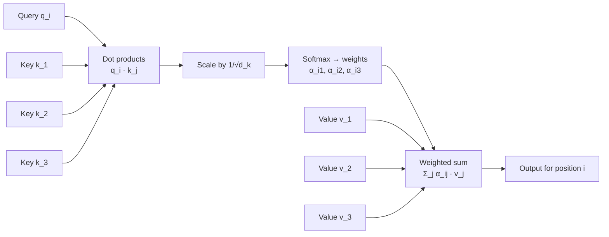

# Attention Fundamentals

> **TL;DR:** Attention lets a model look back at *every* input position and take a weighted average of what it finds, instead of compressing the whole input into one fixed vector. Scaled dot-product attention is the specific recipe transformers use.

---

## Overview

Attention is the single most important mechanism in modern AI engineering: it powers transformers, and transformers power LLMs, vision models, and most production ML systems you will deploy. Before you can read a transformer diagram or debug an attention mask, you need to understand what attention computes and why every term in the formula is there. This lesson builds that foundation from the problem attention was invented to solve.

**By the end, you will be able to:**
- Explain the seq2seq bottleneck problem and how attention removes it
- Derive and interpret scaled dot-product attention, including why the $\sqrt{d_k}$ scaling exists
- Implement attention in NumPy and read an attention weight matrix

---

## Intuition

### The bottleneck problem

Recall the encoder–decoder RNNs from [RNNs, LSTMs and GRUs](../../04-deep-learning/lessons/rnn-lstm-gru.md). To translate a sentence, the encoder reads the input word by word and squeezes *everything* into its final hidden state — one fixed-size vector. The decoder then generates the output from that vector alone.

That single vector is a bottleneck. A 5-word sentence and a 50-word sentence must both fit into the same, say, 512 numbers. On long inputs, early words get overwritten and translation quality degrades. It is like reading a novel, being allowed one sticky note of notes, and then writing the translation from the sticky note.

### The fix: look back, weighted by relevance

The pre-transformer solution (introduced for neural machine translation by Bahdanau and colleagues in 2014–2015, before "Attention Is All You Need") was to keep *all* encoder hidden states and let the decoder glance back at them at every step. When generating the French word for "bank", the decoder should mostly look at the English word "bank" — and a little at its neighbors for context. "How much to look at each position" is a learned, input-dependent set of weights: the **attention weights**.

### Queries, keys, and values: a soft dictionary lookup

Transformers formalize this as a *soft* dictionary lookup:

- A **query** is what you are looking for ("I'm generating a word about finance — who's relevant?").
- Each position offers a **key** (an advertisement: "this is what I contain") and a **value** (the actual content to hand over).
- In a hard dictionary, a query matches exactly one key and you get exactly one value. In attention, the query matches *every* key to some degree, and you get a **weighted average of all values**, weighted by match strength.

Nothing is discarded, so there is no bottleneck — the model just learns where to focus.

---

## Details

### Mathematics

Stack the queries, keys, and values into matrices:

- $Q \in \mathbb{R}^{n_q \times d_k}$ — one query vector per row ($n_q$ queries, each of dimension $d_k$)
- $K \in \mathbb{R}^{n_k \times d_k}$ — one key vector per row ($n_k$ keys, same dimension $d_k$ so dot products are defined)
- $V \in \mathbb{R}^{n_k \times d_v}$ — one value vector per row (one value per key; value dimension $d_v$ may differ from $d_k$)

**Scaled dot-product attention** (Vaswani et al., 2017) is:

$$
\text{Attention}(Q, K, V) = \text{softmax}\!\left(\frac{QK^\top}{\sqrt{d_k}}\right)V
$$

Read it inside-out:

1. **Scores.** $QK^\top \in \mathbb{R}^{n_q \times n_k}$: entry $(i, j)$ is the dot product $q_i \cdot k_j$ — how well query $i$ matches key $j$. Larger dot product means more aligned vectors, meaning higher relevance.
2. **Scaling.** Divide every score by $\sqrt{d_k}$ (explained below).
3. **Softmax.** Applied *row-wise*: each row of scores becomes a probability distribution,
$$
\alpha_{ij} = \frac{\exp\left(q_i \cdot k_j / \sqrt{d_k}\right)}{\sum_{j'=1}^{n_k} \exp\left(q_i \cdot k_{j'} / \sqrt{d_k}\right)},
\qquad \alpha_{ij} \ge 0,\quad \sum_{j=1}^{n_k} \alpha_{ij} = 1
$$
   where $\alpha_{ij}$ is the attention weight query $i$ places on position $j$. Each row is literally a probability distribution over positions — you can read it as "where is this query looking, and how hard?"
4. **Weighted sum.** Multiplying by $V$ gives output row $i$ as $\sum_j \alpha_{ij} v_j$ — a convex combination of value vectors.

**Why divide by $\sqrt{d_k}$?** Suppose the components of $q$ and $k$ are independent with mean $0$ and variance $1$. Then the dot product $q \cdot k = \sum_{m=1}^{d_k} q_m k_m$ has mean $0$ and variance $d_k$ — its typical magnitude grows like $\sqrt{d_k}$. For large $d_k$ (e.g. 64–128), raw scores get large, softmax saturates (one weight $\approx 1$, the rest $\approx 0$), and the softmax gradients become vanishingly small — training stalls. Dividing by $\sqrt{d_k}$ restores unit variance, keeping softmax in a regime with useful gradients. This is exactly the justification given in Vaswani et al., 2017.

### Python implementation

```python
import numpy as np

def softmax(x: np.ndarray, axis: int = -1) -> np.ndarray:
    """Numerically stable softmax."""
    e = np.exp(x - x.max(axis=axis, keepdims=True))
    return e / e.sum(axis=axis, keepdims=True)

def attention(Q: np.ndarray, K: np.ndarray, V: np.ndarray) -> tuple[np.ndarray, np.ndarray]:
    """Scaled dot-product attention. Returns (output, weights)."""
    d_k = Q.shape[-1]
    scores = Q @ K.T / np.sqrt(d_k)     # (n_q, n_k)
    weights = softmax(scores, axis=-1)  # rows sum to 1
    return weights @ V, weights

# Tiny example: 3 tokens, d_k = 4, d_v = 2
Q = np.array([[1., 0., 1., 0.],
              [0., 1., 0., 1.],
              [1., 1., 0., 0.]])
K = np.array([[1., 0., 1., 0.],
              [0., 1., 0., 1.],
              [1., 0., 0., 1.]])
V = np.array([[1., 0.],
              [0., 1.],
              [1., 1.]])

out, w = attention(Q, K, V)
print(np.round(w, 4))
print(np.round(out, 4))
```

Output:

```text
[[0.5065 0.1863 0.3072]
 [0.1863 0.5065 0.3072]
 [0.3333 0.3333 0.3333]]
[[0.8137 0.4935]
 [0.4935 0.8137]
 [0.6667 0.6667]]
```

Each row of the weight matrix sums to 1. Query 1 matches key 1 exactly (dot product 2), so it puts the most weight (0.5065) there.

## Diagram



## Worked Example

Take query 1, $q_1 = [1, 0, 1, 0]$, against the three keys above ($d_k = 4$, so $\sqrt{d_k} = 2$):

1. **Scores:** $q_1 \cdot k_1 = 2$, $q_1 \cdot k_2 = 0$, $q_1 \cdot k_3 = 1$ → $[2, 0, 1]$.
2. **Scale:** divide by $2$ → $[1, 0, 0.5]$.
3. **Softmax:** $e^1 = 2.7183$, $e^0 = 1$, $e^{0.5} = 1.6487$, sum $= 5.3670$ → weights $[0.5065, 0.1863, 0.3072]$.
4. **Weighted sum of values:**
$$
0.5065 \begin{bmatrix}1\\0\end{bmatrix} + 0.1863 \begin{bmatrix}0\\1\end{bmatrix} + 0.3072 \begin{bmatrix}1\\1\end{bmatrix} = \begin{bmatrix}0.8137\\0.4935\end{bmatrix}
$$

That matches row 1 of the NumPy output. Position 1's output is mostly its best-matching value, blended with the others — a soft lookup, not a hard one.

## Best Practices

- ✅ Always sanity-check that attention weight rows sum to 1 — it catches wrong softmax axes immediately.
- ✅ Use a numerically stable softmax (subtract the row max before `exp`) to avoid overflow.
- ✅ Visualize the weight matrix as a heatmap when debugging; degenerate patterns (all-uniform or all-one-column) are easy to spot.

## Common Mistakes

- ⚠️ **Softmax over the wrong axis.** Softmax must run over the *key* dimension (the last axis of the score matrix). The wrong axis still produces valid-looking numbers — verify with the row-sum check.
- ⚠️ **Dropping the $\sqrt{d_k}$ scaling.** Code still runs, and at tiny $d_k$ you may not notice, but at realistic dimensions softmax saturates and gradients vanish. Keep the scaling always.
- ⚠️ **Confusing keys with values.** Keys are compared against the query to decide *how much* to take; values are *what* is taken. They can even have different dimensions ($d_k$ vs $d_v$).

## Industry Tips

- 💡 Attention weight heatmaps are a standard first debugging tool for transformer models — many serving stacks and interpretability tools expose them.
- 💡 The score matrix is $n_q \times n_k$; memory for it, not the matmuls alone, is often what limits sequence length in practice (this becomes the $O(n^2)$ issue in [Self-Attention](self-attention.md)).
- 💡 In production you rarely write this by hand — you call fused kernels (e.g. `torch.nn.functional.scaled_dot_product_attention`) — but interviews and debugging both demand you can reconstruct the formula from scratch.

## Real-World Use Cases

- **Machine translation** — the original motivation: the decoder attends to the relevant source words at each step.
- **Text summarization** — the model attends to salient sentences of the source document while generating.
- **Cross-attention in multimodal models** — text queries attend to image-patch keys/values (image captioning, VQA).

---

## Summary

- Seq2seq RNNs compress the entire input into one fixed vector; attention removes this bottleneck by letting the model take a relevance-weighted average over *all* positions.
- Scaled dot-product attention is $\text{softmax}(QK^\top / \sqrt{d_k})V$: queries match keys via dot products, softmax turns scores into a probability distribution over positions, and the output is a weighted sum of values.
- The $\sqrt{d_k}$ scaling keeps dot-product variance at 1 so the softmax does not saturate and gradients stay usable.

## Practice

- [ ] Exercises: [Module 6 Exercises](../exercises/README.md)
- [ ] Self-check: Without looking, write the attention formula, define every symbol, and explain in two sentences why the scaling factor is $\sqrt{d_k}$ and not, say, $d_k$.

## Further Reading

- 📑 Attention Is All You Need — Vaswani et al., 2017 (https://arxiv.org/abs/1706.03762)
- 🌐 The Illustrated Transformer — Jay Alammar (https://jalammar.github.io/illustrated-transformer/)
- 📘 Dive into Deep Learning (https://d2l.ai/)
- 🎥 3Blue1Brown — visual series on transformers and attention (https://www.youtube.com/@3blue1brown)

## Related

- [Self-Attention](self-attention.md) — the same mechanism applied within a single sequence
- [RNNs, LSTMs and GRUs](../../04-deep-learning/lessons/rnn-lstm-gru.md) — the bottleneck architecture attention fixes

---

## Navigation

- ⬆️ [Lessons](README.md)
- 📚 [Module 6 — Transformers](../README.md)
- 🏠 [Knowledge Base Home](../../README.md)
