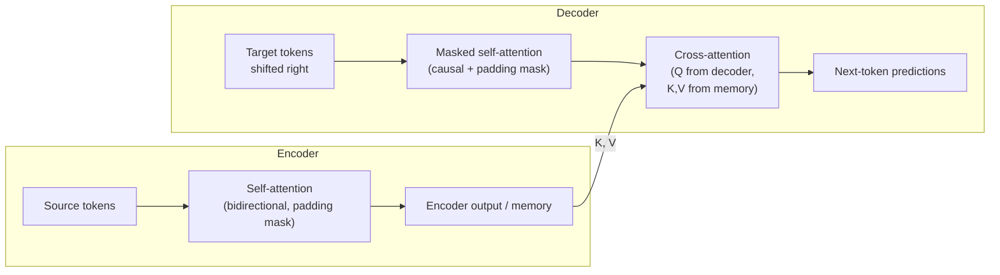

# Masked and Cross-Attention

> **TL;DR:** Causal masking adds $-\infty$ to attention scores above the diagonal so each position can only attend to itself and earlier positions — which lets you train all positions of a generator in parallel without letting it cheat. Cross-attention takes queries from the decoder and keys/values from the encoder, so the decoder can consult the source sequence while generating.

---

## Overview

Plain self-attention is bidirectional: every token sees every other token. That is fine for understanding a sentence, but fatal for generating one — a model that can see the word it is supposed to predict learns nothing. This lesson covers the two attention variants that make the original encoder-decoder transformer work: causal (masked) self-attention in the decoder, and cross-attention connecting decoder to encoder. You will also see how padding masks differ from causal masks and where each attention type lives in the architecture.

**By the end, you will be able to:**
- Construct a causal mask and explain why it must apply $-\infty$ before the softmax, not zeros after
- Distinguish padding masks from causal masks and combine them correctly
- Implement cross-attention in PyTorch and state where Q, K, and V each come from

---

## Intuition

**Masked self-attention: no peeking.** Text generation is left-to-right: when producing token 5, the model only knows tokens 1–4. But during training we want to feed the whole target sentence in at once and train *every* position simultaneously — that is what makes transformers fast to train. The trick is *teacher forcing*: give the model the full ground-truth sequence as input, ask it to predict token $i{+}1$ at position $i$, and blindfold each position so it cannot see anything to its right. The blindfold is the causal mask. One forward pass then contains $n$ separate next-token prediction problems, all trained in parallel, none able to cheat.

**Cross-attention: consulting the source.** In translation, the decoder generates the German sentence, but it must constantly look back at the English source to know what to say next. Cross-attention is that look-back: each decoder position asks a question (query) and the answers (keys and values) come from the *encoder's* output. Same attention arithmetic, different provenance of Q versus K and V. Think of the decoder as a writer and the encoder output as reference notes on the desk: self-attention is the writer re-reading their own draft; cross-attention is glancing at the notes.

---

## Details

### Mathematics

**Causal masking.** Let $S \in \mathbb{R}^{n \times n}$ be the matrix of scaled attention scores, where $S_{ij}$ is how much position $i$ (the query) wants to attend to position $j$ (the key), and $n$ is the sequence length. Define the causal mask $M \in \mathbb{R}^{n \times n}$:

$$
M_{ij} = \begin{cases} 0 & j \le i \\ -\infty & j > i \end{cases}
$$

Masked attention replaces $S$ with $S + M$ before the softmax:

$$
\text{Attention}(Q, K, V) = \text{softmax}\!\left(\frac{QK^\top}{\sqrt{d_k}} + M\right)V
$$

where $Q, K, V$ are the query, key, and value matrices and $d_k$ is the key dimension (as in the previous lessons).

For a 4-token sequence, suppose the raw scores are (values illustrative):

$$
S = \begin{pmatrix} 2 & 1 & 3 & 0 \\ 1 & 2 & 1 & 2 \\ 0 & 1 & 2 & 1 \\ 1 & 0 & 1 & 2 \end{pmatrix}
\quad\Rightarrow\quad
S + M = \begin{pmatrix} 2 & -\infty & -\infty & -\infty \\ 1 & 2 & -\infty & -\infty \\ 0 & 1 & 2 & -\infty \\ 1 & 0 & 1 & 2 \end{pmatrix}
$$

After row-wise softmax ($e^{-\infty} = 0$), rounded:

$$
\text{softmax}(S + M) \approx \begin{pmatrix} 1.00 & 0 & 0 & 0 \\ 0.27 & 0.73 & 0 & 0 \\ 0.09 & 0.24 & 0.67 & 0 \\ 0.21 & 0.08 & 0.21 & 0.50 \end{pmatrix}
$$

Row 1 attends only to itself; row 4 attends to everything at or before it. Every row is still a valid probability distribution.

**Why $-\infty$ before softmax, not zeroing after.** If you instead computed the softmax over all positions and then zeroed the future entries, the rows would no longer sum to 1 — probability mass "leaks" to the masked positions and the surviving weights are systematically too small. Worse, the leaked mass depended on future keys, so future information still influenced the normalization. Adding $-\infty$ *before* softmax makes the forbidden entries exactly $e^{-\infty} = 0$ and renormalizes the allowed ones automatically: each row stays a proper distribution over only the visible positions.

**Padding masks.** Batches contain sequences of different lengths, padded to a common length with a `<pad>` token. Padding positions carry no content, so no real token should attend to them. A padding mask sets $-\infty$ on score columns corresponding to pad keys. Contrast:

- *Causal mask*: shape $(n, n)$, structural, same for every sequence — hides the **future**.
- *Padding mask*: shape $(batch, n)$ broadcast over queries, data-dependent — hides **empty slots**.

In a decoder they are combined (elementwise: a position is masked if *either* mask forbids it).

**Cross-attention.** Let $Z \in \mathbb{R}^{m \times d_{model}}$ be the encoder's final output ("memory") for a source sequence of length $m$, and $Y \in \mathbb{R}^{n \times d_{model}}$ the decoder's current hidden states for a target of length $n$. Cross-attention computes:

$$
\text{CrossAttention}(Y, Z) = \text{softmax}\!\left(\frac{(Y W^Q)(Z W^K)^\top}{\sqrt{d_k}}\right) Z W^V
$$

Queries come from the decoder ($Y W^Q$); keys and values come from the encoder memory ($Z W^K$, $Z W^V$). The score matrix has shape $n \times m$ — target positions attending over source positions. No causal mask applies here: the full source sentence is legitimately known, so the decoder may look at all of it (only a source-side padding mask is needed).

**Where each attention type lives:**

| Location | Attention type | Q from | K, V from | Mask |
|----------|----------------|--------|-----------|------|
| Encoder layer | Bidirectional self-attention | source | source | padding only |
| Decoder layer, sublayer 1 | Causal (masked) self-attention | target | target | causal + padding |
| Decoder layer, sublayer 2 | Cross-attention | target | **encoder output** | source padding only |

Decoder-only models (the GPT family) delete the encoder and the cross-attention sublayer entirely, keeping just causal self-attention — more on that trade-off in the architecture-variants lesson.

### Python implementation

```python
import torch
import torch.nn.functional as F

from multi_head_attention import MultiHeadAttention  # the module from the previous lesson


def causal_mask(seq_len: int) -> torch.Tensor:
    """Boolean mask: True = attend allowed, False = blocked (future)."""
    # torch.triu with diagonal=1 selects strictly-above-diagonal entries (the future).
    future = torch.triu(torch.ones(seq_len, seq_len, dtype=torch.bool), diagonal=1)
    return ~future  # (seq_len, seq_len), lower triangle True


def masked_attention_scores(scores: torch.Tensor) -> torch.Tensor:
    """Apply a causal mask to raw scores (..., seq_q, seq_k) before softmax."""
    seq_len = scores.size(-1)
    mask = causal_mask(seq_len).to(scores.device)          # (seq, seq)
    scores = scores.masked_fill(~mask, float("-inf"))      # block the future
    return F.softmax(scores, dim=-1)


if __name__ == "__main__":
    d_model, h = 512, 8

    # --- Causal self-attention (decoder sublayer 1) ---
    self_attn = MultiHeadAttention(d_model, h)
    tgt = torch.randn(2, 6, d_model)                       # (batch, tgt_len, d_model)
    mask = causal_mask(6)                                  # (6, 6) — broadcasts over batch & heads
    out = self_attn(tgt, tgt, tgt, mask=mask)              # Q = K = V = decoder states
    print(out.shape)                                       # torch.Size([2, 6, 512])

    # --- Cross-attention (decoder sublayer 2) ---
    cross_attn = MultiHeadAttention(d_model, h)
    memory = torch.randn(2, 9, d_model)                    # encoder output, src_len = 9
    out = cross_attn(query=out, key=memory, value=memory)  # Q from decoder, K/V from encoder
    print(out.shape)                                       # torch.Size([2, 6, 512]) — tgt_len preserved
```

Note the shapes in cross-attention: queries keep the target length (6), keys and values carry the source length (9), and the internal score matrix is `(2, 8, 6, 9)`. The output length always follows the queries. PyTorch's built-in `F.scaled_dot_product_attention(..., is_causal=True)` builds and applies the causal mask for you with an optimized kernel.

## Diagram



## Worked Example

Translate "the cat sat" into German with a trained encoder-decoder model, target "die Katze saß".

1. **Encode.** The encoder runs bidirectional self-attention over `[the, cat, sat]` — "cat" may freely attend to "sat" on its right — producing memory $Z$ of shape `(3, d_model)`.
2. **Training step (teacher forcing).** Feed the decoder the shifted target `[<bos>, die, Katze]` and ask it to predict `[die, Katze, saß]`. All three predictions happen in one forward pass.
3. **Causal self-attention.** Position 2 (input "Katze", predicting "saß") gets scores against all three decoder positions, but the mask adds $-\infty$ to any position beyond index 2 — here there is nothing beyond it, while position 0 ("`<bos>`", predicting "die") is restricted to itself alone. No position ever sees the token it must predict.
4. **Cross-attention.** Each decoder position queries the memory: the position predicting "Katze" typically places high weight on the source token "cat", and the position predicting "saß" on "sat". The score matrix is `3 × 3` here (target × source) and is *not* causally masked — the whole English sentence is fair game.
5. **Inference.** No ground-truth target exists, so generation really is sequential: predict "die", append it, run again, predict "Katze", and so on. The causal mask makes training-time parallelism *consistent* with this inference-time loop — each training position saw exactly what the inference loop would have seen.

## Best Practices

- ✅ Build masks as boolean tensors and apply them with `masked_fill(~mask, float("-inf"))` — clearer and safer than adding large negative constants like `-1e9`.
- ✅ Combine causal and padding masks with logical AND before applying, and unit-test the combined mask on a tiny batch with unequal lengths.
- ✅ Cache the causal mask (register it as a buffer up to a max length) instead of rebuilding it every forward pass.
- ✅ Prefer `F.scaled_dot_product_attention(..., is_causal=True)` in production — the fused kernel handles masking without materializing the full mask.

## Common Mistakes

- ⚠️ **Zeroing attention weights after softmax instead of masking scores before.** The rows stop summing to 1 and future keys still influenced normalization. Fix: add $-\infty$ to scores, then softmax.
- ⚠️ **Wrong `triu` diagonal.** `torch.triu(x, diagonal=0)` masks the diagonal itself, so tokens cannot attend to *themselves* — training silently degrades. Fix: `diagonal=1` masks strictly-future positions only.
- ⚠️ **Applying a causal mask in cross-attention.** Target and source lengths differ and there is no "future" in the source; a causal mask there just deletes valid context. Fix: only the source padding mask belongs in cross-attention.
- ⚠️ **Forgetting the padding mask in the encoder.** Real tokens then attend to `<pad>` garbage, and quality drops in ways that only appear on batched, variable-length data. Fix: always pass key padding masks when batching.
- ⚠️ **Confusing mask polarity.** Some APIs expect `True` = "masked out" (e.g. `nn.MultiheadAttention`'s `key_padding_mask`), others `True` = "keep". Fix: read the specific function's docs and name your tensors explicitly (`keep_mask` vs `pad_mask`).

## Industry Tips

- 💡 A fully softmaxed row where all entries would be $-\infty$ (e.g. an all-padding row) produces NaNs; production code guards against empty rows or lets fused kernels handle them.
- 💡 During autoregressive inference, decoder-only models cache past keys and values (the KV cache) so each new token computes attention only against stored K/V instead of re-encoding the whole prefix — the causal structure is what makes this cache valid.
- 💡 When debugging a generative model that looks "too good" during training and falls apart at inference, check the mask first: an off-by-one or missing causal mask that leaks future tokens is a classic cause.

## Real-World Use Cases

- Machine translation and summarization: encoder-decoder models (the original Transformer, and models like it) rely on causal decoding plus cross-attention to the source.
- GPT-style chat and code assistants: decoder-only stacks of causal self-attention, no cross-attention at all.
- Speech-to-text systems: an audio encoder with a text decoder that cross-attends to the acoustic representation.

---

## Summary

- The causal mask adds $-\infty$ above the diagonal of the score matrix before softmax, so each position attends only to itself and its past — enabling parallel teacher-forced training that matches sequential inference.
- Padding masks hide empty batch slots and are data-dependent; causal masks hide the future and are structural. Decoders combine both.
- Cross-attention takes Q from the decoder and K, V from the encoder output; decoder-only models (GPT family) drop it entirely, which the architecture-variants lesson explores.

## Practice

- [ ] Exercises: [Module 6 Exercises](../exercises/README.md)
- [ ] Self-check: In cross-attention with a source of length 12 and a target of length 7, what is the shape of the attention score matrix per head, and which of the two masks (causal, padding) applies?

## Further Reading

- 📑 Attention Is All You Need — Vaswani et al., 2017 (https://arxiv.org/abs/1706.03762)
- 🌐 The Illustrated Transformer — Jay Alammar (https://jalammar.github.io/illustrated-transformer/)
- 🌐 The Annotated Transformer (https://nlp.seas.harvard.edu/annotated-transformer/)
- 📘 Dive into Deep Learning (https://d2l.ai/)
- 🎥 Andrej Karpathy — builds GPT from scratch, including causal masking (https://www.youtube.com/@AndrejKarpathy)

## Related

- [Multi-Head Attention](multi-head-attention.md)
- [The Transformer Architecture](transformer-architecture.md)
- [Architecture Variants](architecture-variants.md)
- [Sequence-to-Sequence Tasks](../../05-nlp/lessons/sequence-to-sequence-tasks.md)

---

## Navigation

- ⬆️ [Lessons](README.md)
- 📚 [Module 6 — Transformers](../README.md)
- 🏠 [Knowledge Base Home](../../README.md)
