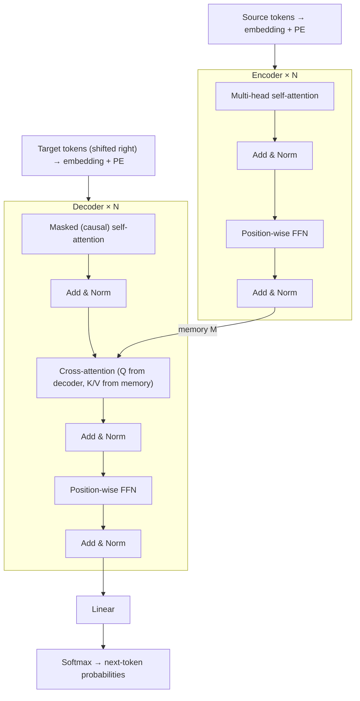

# The Transformer Architecture

> **TL;DR:** The Transformer stacks identical blocks — attention, then a position-wise feed-forward network, each wrapped in a residual connection and LayerNorm — into an encoder that reads the source and a decoder that generates the target while attending to the encoder's output.

---

## Overview

You already know the parts: multi-head attention, masking, and positional encoding. This lesson assembles them into the full architecture from "Attention Is All You Need" (Vaswani et al., 2017): encoder blocks, decoder blocks, the feed-forward sublayer, residual connections, and layer normalization. You will trace one translation example end to end and see why training is parallel but inference is sequential.

**By the end, you will be able to:**
- Draw and explain every sublayer of an encoder block and a decoder block, including where Add & Norm sits.
- State the roles of the position-wise FFN, residual connections, and LayerNorm — and the post-LN vs pre-LN distinction.
- Implement an encoder block in PyTorch and describe the full data flow for training and for autoregressive inference.

---

## Intuition

Think of the encoder as a **reading committee** and the decoder as a **writer with notes**. Each encoder block lets every source token consult every other source token (self-attention: "gather context"), then think privately about what it gathered (FFN: "process what you heard"). Stack the block $N$ times and each token's representation becomes a deeply contextualized summary. The final stack output — the *memory* — is the committee's annotated reading of the source.

The decoder writes the translation one token at a time. Each decoder block does three things: look back at what it has written so far (causal self-attention — no peeking at future words), consult the committee's notes (cross-attention into the memory), then process privately (FFN).

Two engineering devices make deep stacks trainable. **Residual connections** give gradients a highway: each sublayer computes a *correction* added to its input rather than a full replacement, so signal flows through dozens of layers without vanishing — the same idea that made ResNets work. **LayerNorm** re-standardizes each token's feature vector so activations stay in a healthy range from block to block.

---

## Details

### Mathematics

**The encoder block.** With input $x \in \mathbb{R}^{n \times d_{model}}$ ($n$ = sequence length, $d_{model}$ = model width), one block computes two sublayers, each wrapped as "Add & Norm":

$$x' = \mathrm{LayerNorm}\big(x + \mathrm{MultiHead}(x, x, x)\big), \qquad y = \mathrm{LayerNorm}\big(x' + \mathrm{FFN}(x')\big)$$

where $\mathrm{MultiHead}(Q, K, V)$ is multi-head attention with queries, keys, and values all derived from the same sequence (self-attention).

**The position-wise feed-forward network.** Applied to each token independently and identically:

$$\mathrm{FFN}(x) = \max(0,\, xW_1 + b_1)\,W_2 + b_2$$

where $W_1 \in \mathbb{R}^{d_{model} \times d_{ff}}$, $W_2 \in \mathbb{R}^{d_{ff} \times d_{model}}$ are weight matrices, $b_1$, $b_2$ are biases, and $\max(0, \cdot)$ is ReLU. The original paper uses $d_{ff} = 2048 = 4 \times d_{model}$ — a 4× expansion. The FFN is where each token is processed *nonlinearly on its own* after attention has mixed information across tokens; with two $d_{model} \times d_{ff}$ matrices per block, the FFN holds the majority of a Transformer block's parameters.

**LayerNorm.** For one token's feature vector $z \in \mathbb{R}^{d_{model}}$:

$$\mathrm{LayerNorm}(z) = \gamma \odot \frac{z - \mu}{\sigma + \epsilon} + \beta$$

where $\mu$ and $\sigma$ are the mean and standard deviation *across the features of that token*, $\gamma, \beta \in \mathbb{R}^{d_{model}}$ are learned scale/shift parameters, $\epsilon$ is a small constant for numerical stability, and $\odot$ is element-wise multiplication. Unlike BatchNorm, it never mixes statistics across tokens or examples.

**Post-LN vs pre-LN.** The original paper applies LayerNorm *after* the residual addition ($\mathrm{LN}(x + \mathrm{Sublayer}(x))$, "post-LN"). Most modern implementations (including GPT-2 onward) instead use **pre-LN**: $x + \mathrm{Sublayer}(\mathrm{LN}(x))$, normalizing the sublayer *input* and leaving the residual path clean. Pre-LN trains more stably in deep stacks and typically removes the need for the careful learning-rate warmup that post-LN requires.

**The decoder block.** Three sublayers, each with Add & Norm:

1. **Causal (masked) self-attention** over the target prefix — position $t$ may attend only to positions $\le t$.
2. **Cross-attention** — queries come from the decoder, keys and values from the encoder memory $M$: $\mathrm{MultiHead}(x, M, M)$.
3. **FFN**, identical in form to the encoder's.

**Full data flow (translation).**

$$\text{source tokens} \to \text{embeddings} + PE \to \underbrace{\text{encoder block} \times N}_{\text{memory } M}$$
$$\text{target tokens} \to \text{embeddings} + PE \to \underbrace{\text{decoder block} \times N}_{\text{attending to } M} \to \text{linear} \to \mathrm{softmax} \to p(\text{next token})$$

**Original hyperparameters** (base model, Vaswani et al., 2017): $N = 6$ encoder and 6 decoder blocks, $d_{model} = 512$, $h = 8$ attention heads, $d_{ff} = 2048$.

**Training vs inference.** During training, the entire target sentence is fed in at once, shifted right, with the causal mask preventing each position from seeing its own answer — so all $n$ next-token predictions are computed **in parallel** in one forward pass (teacher forcing: the model conditions on the *true* previous tokens, not its own guesses). At inference there is no target to feed: the model generates **autoregressively**, one token per forward pass, appending each prediction to the input for the next step. This sequential loop — $T$ forward passes for $T$ tokens, each attending over an ever-growing prefix — is why generation, not training-style scoring, is the slow part of serving Transformers.

### Python implementation

An encoder block assembled from components you built in previous lessons (a `MultiHeadAttention` module with signature `forward(q, k, v, mask=None)`), shown here in the modern pre-LN form with the paper's post-LN noted:

```python
import torch
import torch.nn as nn

class FeedForward(nn.Module):
    """Position-wise FFN: d_model -> d_ff -> d_model, applied per token."""
    def __init__(self, d_model: int, d_ff: int, dropout: float = 0.1) -> None:
        super().__init__()
        self.net = nn.Sequential(
            nn.Linear(d_model, d_ff), nn.ReLU(),
            nn.Dropout(dropout), nn.Linear(d_ff, d_model),
        )

    def forward(self, x: torch.Tensor) -> torch.Tensor:
        return self.net(x)

class EncoderBlock(nn.Module):
    """Pre-LN encoder block: x + Attn(LN(x)), then x + FFN(LN(x))."""
    def __init__(self, d_model: int = 512, n_heads: int = 8,
                 d_ff: int = 2048, dropout: float = 0.1) -> None:
        super().__init__()
        self.attn = MultiHeadAttention(d_model, n_heads)  # from the MHA lesson
        self.ffn = FeedForward(d_model, d_ff, dropout)
        self.norm1 = nn.LayerNorm(d_model)
        self.norm2 = nn.LayerNorm(d_model)
        self.dropout = nn.Dropout(dropout)

    def forward(self, x: torch.Tensor,
                mask: torch.Tensor | None = None) -> torch.Tensor:
        h = self.norm1(x)                                  # pre-LN
        x = x + self.dropout(self.attn(h, h, h, mask))     # Add (residual)
        x = x + self.dropout(self.ffn(self.norm2(x)))      # Add & (pre-)Norm
        return x
        # Original post-LN variant instead computes:
        #   x = norm1(x + dropout(attn(x, x, x, mask)))
        #   x = norm2(x + dropout(ffn(x)))

encoder = nn.Sequential(*[EncoderBlock() for _ in range(6)])   # N = 6
x = torch.randn(2, 10, 512)          # (batch, seq_len, d_model), already embedded + PE
memory = encoder(x)
print(memory.shape)                  # torch.Size([2, 10, 512])
```

A decoder block adds a causal mask to its first attention and a second attention `self.cross_attn(h, memory, memory)` between self-attention and the FFN — same Add & Norm wrapping around each sublayer.

## Diagram



## Worked Example

Translate "Der Hund bellt" to "The dog barks" with the base model ($N=6$, $d_{model}=512$, $h=8$, $d_{ff}=2048$):

1. **Encode.** Tokenize the German source into, say, 3 tokens; embed each into $\mathbb{R}^{512}$ and add positional encodings → a $3 \times 512$ matrix. Pass it through 6 encoder blocks. In each, the three tokens exchange information (self-attention: "bellt" learns it has subject "Hund"), then each is processed alone (FFN). Output: memory $M \in \mathbb{R}^{3 \times 512}$. This happens **once**.
2. **Decode step 1.** Feed the start token `<bos>`. Causal self-attention sees only `<bos>`; cross-attention queries $M$ and focuses on "Der"/"Hund"; the FFN, linear, and softmax layers produce a distribution over the vocabulary — "The" is picked.
3. **Decode step 2.** Feed `<bos> The`. Position 1 attends to both target tokens so far and cross-attends to $M$ (now weighting "Hund") → "dog".
4. **Repeat** until the model emits `<eos>`: `<bos> The dog barks` → done, in 4 sequential decoder passes.

During *training* on this pair, steps 2–4 collapse into one pass: the decoder input is the whole shifted target `<bos> The dog barks`, the causal mask hides future tokens from each position, and the loss compares all four predictions against `The dog barks <eos>` simultaneously.

## Best Practices

- ✅ Use pre-LN for anything deeper than a few blocks — it is markedly more stable and the reason most modern codebases diverge from the paper's post-LN layout.
- ✅ Keep the residual stream's width ($d_{model}$) constant through every sublayer; only the FFN expands internally (4× in the original) and projects back.
- ✅ Apply dropout to each sublayer's output *before* the residual addition, as in the original paper.

## Common Mistakes

- ⚠️ **Wiring cross-attention with queries from the encoder.** Queries must come from the decoder; keys and values come from the encoder memory. Reversing them silently produces garbage that still type-checks.
- ⚠️ **Forgetting the causal mask at training time.** The model then sees the token it is predicting, achieves suspiciously low loss, and fails completely at generation. If training loss looks too good, check the mask first.
- ⚠️ **Confusing LayerNorm with BatchNorm.** LayerNorm normalizes across the feature dimension of each token independently — it does not depend on batch statistics, which is exactly why it suits variable-length sequences.

## Industry Tips

- 💡 Because inference is a sequential loop over the decoder, production systems cache the keys and values of already-generated tokens (the KV cache) so each step only computes attention for the newest token — the single most important serving optimization.
- 💡 Encoder-only (BERT), decoder-only (GPT), and encoder-decoder (T5, translation) models are all this same block diagram with parts deleted; once you can draw this architecture, you can draw all three families.

## Real-World Use Cases

- Neural machine translation — the original application, encoder-decoder with cross-attention.
- Decoder-only LLM chat and code assistants — the decoder stack (minus cross-attention) scaled up.
- Summarization and speech-to-text (e.g., encoder-decoder models like T5 and Whisper-style architectures) where an input sequence is transformed into a different output sequence.

---

## Summary

- Encoder block = self-attention → Add & Norm → position-wise FFN → Add & Norm; decoder block inserts causal masking and cross-attention into the encoder memory.
- Residual connections keep gradients flowing through deep stacks; LayerNorm keeps activations well-scaled — post-LN in the paper, pre-LN in most modern implementations for stability.
- Training is parallel (teacher forcing under a causal mask); inference is autoregressive and therefore the expensive part. Base model: $N=6$, $d_{model}=512$, $h=8$, $d_{ff}=2048$.

## Practice

- [ ] Exercises: [Module 6 Exercises](../exercises/README.md)
- [ ] Self-check: In a decoder block, which sublayer takes its keys and values from the encoder, and why must its queries come from the decoder?

## Further Reading

- 📑 Attention Is All You Need — Vaswani et al., 2017 (https://arxiv.org/abs/1706.03762)
- 🌐 The Annotated Transformer — Harvard NLP (https://nlp.seas.harvard.edu/annotated-transformer/)
- 🌐 The Illustrated Transformer — Jay Alammar (https://jalammar.github.io/illustrated-transformer/)
- 📘 Dive into Deep Learning (https://d2l.ai/)
- 🌐 PyTorch documentation (https://pytorch.org/docs/stable/)

## Related

- [Multi-Head Attention](multi-head-attention.md)
- [Masked and Cross-Attention](masked-and-cross-attention.md)
- [Building a Transformer from Scratch](transformer-from-scratch.md)
- [Regularization and Training](../../04-deep-learning/lessons/regularization-and-training.md) — residual connections and normalization in depth

---

## Navigation

- ⬆️ [Lessons](README.md)
- 📚 [Module 6 — Transformers](../README.md)
- 🏠 [Knowledge Base Home](../../README.md)
