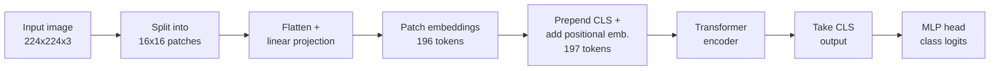

# Vision Transformers

> **TL;DR:** A Vision Transformer (ViT) cuts an image into fixed-size patches, linearly projects each patch into a token embedding, prepends a learnable `[CLS]` token, adds positional embeddings, and runs the sequence through a standard transformer encoder — classifying from the `[CLS]` output.

---

## Overview

The Vision Transformer, introduced by Dosovitskiy et al. (2020), showed that the transformer architecture built for text — nearly unchanged — can handle images once you reframe an image as a sequence of tokens. Instead of sliding convolutional filters, you split the image into a grid of patches and treat each patch as a "word." This unified images and text under one architecture and paved the way for modern multimodal models.

**By the end, you will be able to:**
- Explain how an image becomes a token sequence (patchify → project → add `[CLS]` and positional embeddings).
- Compute the number of tokens a ViT sees for a given image and patch size.
- Contrast the inductive biases of ViT and CNNs, and know when each is the right choice.

---

## Intuition

A transformer encoder does not care whether its input tokens are words, sub-words, or something else — it just needs a sequence of vectors. So the whole trick of ViT is: **how do you turn a 2D image into a 1D sequence of vectors?**

The answer is deliberately simple. Chop the image into a grid of non-overlapping squares (say 16×16 pixels each). Flatten each square into a vector and project it to the model's hidden size. Now you have a sequence of "patch tokens" — the direct analog of word embeddings. From there, everything you already know about transformer encoders applies unchanged: self-attention lets every patch look at every other patch, so the model can relate the top-left corner to the bottom-right one in a single layer.

Because attention is order-agnostic, you also add **positional embeddings** so the model knows where each patch came from, and you prepend one special learnable token whose job is to aggregate global information for the final classification.

---

## Details

### Concepts

Start with an image of height $H$, width $W$, and $C$ channels. Choose a patch size $P$ (e.g. $P = 16$). Split the image into a grid of non-overlapping patches. The number of patches is

$$
N = \frac{H \cdot W}{P^2} = \frac{H}{P} \cdot \frac{W}{P},
$$

where $N$ is the resulting sequence length (before the `[CLS]` token). Each patch has $P^2 \cdot C$ pixel values; flatten it into a vector $x_p \in \mathbb{R}^{P^2 C}$.

**Patch embedding.** A single learnable linear projection $E \in \mathbb{R}^{(P^2 C) \times d_{model}}$ maps every flattened patch to a $d_{model}$-dimensional embedding, where $d_{model}$ is the transformer's hidden size:

$$
z_i = x_{p,i} E, \qquad i = 1, \dots, N.
$$

**`[CLS]` token.** A learnable vector $x_{cls} \in \mathbb{R}^{d_{model}}$ is prepended to the sequence. After the encoder, the final state at this position serves as the image representation fed to the classifier — the same idea used by BERT for sentence classification.

**Positional embeddings.** Learnable position vectors $E_{pos} \in \mathbb{R}^{(N+1) \times d_{model}}$ are added element-wise so the model can recover spatial order:

$$
z_0 = [\,x_{cls};\, z_1;\, z_2;\, \dots;\, z_N\,] + E_{pos}.
$$

This sequence $z_0$ (length $N+1$) is fed into a standard transformer **encoder** (multi-head self-attention + MLP blocks, as in "Attention Is All You Need"). Classification reads the final `[CLS]` state through a small MLP head.

**Inductive bias vs CNNs.** CNNs hard-code two priors: **locality** (a filter sees only a small neighborhood) and **translation equivariance** (the same filter slides everywhere). ViT bakes in far less spatial structure — self-attention is global from layer one, and spatial relationships must be learned from the data. The paper reports the practical consequence: trained from scratch on mid-sized datasets, ViT tends to underperform comparable CNNs, but with **large-scale pretraining** it matches or surpasses them. In short, ViT is data-hungry but scales well.

**Practical reality.** You rarely train a ViT from scratch. Pretrained ViT checkpoints fine-tune well on modest datasets, which is how most practitioners use them today. The ViT design also underlies the image tower of models like CLIP and many modern multimodal systems.

### Python implementation

The standard implementation trick: a strided `nn.Conv2d` with `kernel_size == stride == patch_size` performs patchifying **and** the linear projection in one operation — each kernel application covers exactly one non-overlapping patch.

```python
import torch
import torch.nn as nn


class PatchEmbedding(nn.Module):
    def __init__(
        self,
        image_size: int = 224,
        patch_size: int = 16,
        in_channels: int = 3,
        d_model: int = 768,
    ) -> None:
        super().__init__()
        self.num_patches = (image_size // patch_size) ** 2
        # kernel_size == stride == patch_size: one conv step per patch.
        self.proj = nn.Conv2d(
            in_channels, d_model, kernel_size=patch_size, stride=patch_size
        )
        self.cls_token = nn.Parameter(torch.zeros(1, 1, d_model))
        self.pos_embed = nn.Parameter(
            torch.zeros(1, self.num_patches + 1, d_model)
        )

    def forward(self, x: torch.Tensor) -> torch.Tensor:
        b = x.shape[0]
        x = self.proj(x)                 # (B, d_model, H/P, W/P)
        x = x.flatten(2).transpose(1, 2)  # (B, N, d_model)
        cls = self.cls_token.expand(b, -1, -1)  # (B, 1, d_model)
        x = torch.cat([cls, x], dim=1)   # (B, N+1, d_model)
        return x + self.pos_embed        # add positional embeddings


images = torch.randn(2, 3, 224, 224)  # (batch, channels, H, W)
tokens = PatchEmbedding()(images)
print(tokens.shape)  # torch.Size([2, 197, 768])  -> 196 patches + 1 CLS
```

For real work, use a pretrained model from Hugging Face rather than training the encoder yourself:

```python
from transformers import ViTForImageClassification, ViTImageProcessor
from PIL import Image
import torch

name = "google/vit-base-patch16-224"
processor = ViTImageProcessor.from_pretrained(name)
model = ViTForImageClassification.from_pretrained(name)

image = Image.open("cat.jpg")
inputs = processor(images=image, return_tensors="pt")

with torch.no_grad():
    logits = model(**inputs).logits

pred = logits.argmax(-1).item()
print(model.config.id2label[pred])
```

## Diagram



## Worked Example

Take the canonical ViT-Base setup: a $224 \times 224$ RGB image with patch size $P = 16$.

Patches along each axis:

$$
\frac{H}{P} = \frac{224}{16} = 14, \qquad \frac{W}{P} = \frac{224}{16} = 14.
$$

Total patch tokens:

$$
N = 14 \times 14 = 196.
$$

Add the single `[CLS]` token:

$$
N + 1 = 196 + 1 = 197.
$$

So the encoder processes a sequence of length **197**, each token a vector of size $d_{model} = 768$ in ViT-Base. Note the sensitivity to patch size: halving $P$ to 8 would give $(224/8)^2 = 784$ tokens — roughly $4\times$ the sequence length, and since attention cost grows quadratically with sequence length, roughly $16\times$ the attention compute.

## Best Practices

- ✅ Start from a pretrained checkpoint and fine-tune; training ViT from scratch needs very large datasets.
- ✅ Always use the model's matching image processor so resizing and normalization match pretraining.
- ✅ Pick patch size deliberately — smaller patches capture finer detail but cost quadratically more attention.

## Common Mistakes

- ⚠️ Choosing an image size not divisible by the patch size — the patch grid becomes ambiguous. Fix: resize so $H$ and $W$ are exact multiples of $P$.
- ⚠️ Expecting from-scratch ViT to beat a CNN on a small dataset. Fix: pretrain on large data or fine-tune an existing checkpoint.
- ⚠️ Forgetting the `[CLS]` token when computing sequence length or reading the output — classification uses the `[CLS]` state, not a pooled average by default.

## Industry Tips

- 💡 The strided-conv patch embedding is not an approximation — it is mathematically the linear projection, and it is how reference implementations do it.
- 💡 ViT backbones are the image encoder in CLIP and many multimodal LLMs, so understanding ViT transfers directly to modern vision-language systems.

## Real-World Use Cases

- Image classification and transfer learning from large pretrained backbones.
- Vision-language models: ViT provides the image tower in CLIP-style dual encoders and multimodal assistants.
- Fine-grained recognition and medical imaging, where pretrained ViTs adapt well to modest labeled datasets.

---

## Summary

- ViT reframes an image as a sequence of patch tokens, then applies a standard transformer encoder — no convolutions in the core.
- A $224 \times 224$ image with $16 \times 16$ patches yields $196$ patch tokens plus a `[CLS]` token = $197$ tokens.
- ViT has weaker spatial inductive bias than CNNs, so it needs large-scale pretraining (or fine-tuning a pretrained checkpoint) to shine.

## Practice

- [ ] Exercises: [Module 6 Exercises](../exercises/README.md)
- [ ] Self-check: For a $384 \times 384$ image with patch size $32$, how many tokens does the encoder process, including `[CLS]`?

## Further Reading

- 📑 An Image is Worth 16x16 Words — Dosovitskiy et al., 2020 (https://arxiv.org/abs/2010.11929)
- 📄 [Hugging Face documentation](https://huggingface.co/docs)
- 📘 Dive into Deep Learning (https://d2l.ai/)

## Related

- [Architecture Variants: Encoder-Only, Decoder-Only, Encoder-Decoder](architecture-variants.md)
- [Convolutional Neural Networks](../../04-deep-learning/lessons/cnn.md)

---

## Navigation
- ⬆️ [Lessons](README.md)
- 📚 [Module 6 — Transformers](../README.md)
- 🏠 [Knowledge Base Home](../../README.md)
