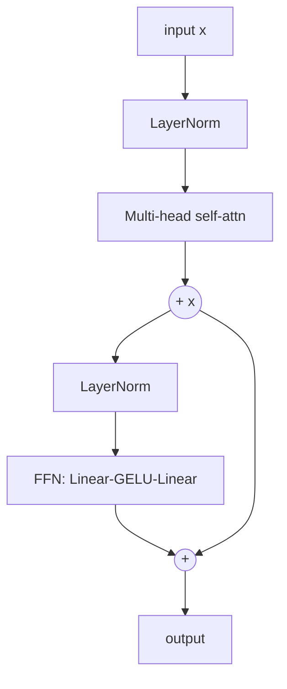

# Mini Project: Annotated Transformer Block

> **What you'll build:** One production-quality, richly-commented transformer
> block (attention + FFN + residuals + LayerNorm) with tests that verify each
> sub-layer — the reusable unit every transformer stacks.

---

## Objective

Before stacking N layers, get *one* exactly right. You'll implement a single
pre-LN transformer block with impeccable shape annotations and a test suite that
pins down each sub-layer's behavior — the foundation for the full model.

## Learning Goals

- Compose attention, FFN, residuals, and normalization into one block.
- Reason precisely about shapes and the residual data path.
- Test a neural module beyond "it runs."

---

## Prerequisites

- [The Transformer Architecture](../lessons/transformer-architecture.md), [Building a Transformer from Scratch](../lessons/transformer-from-scratch.md)
- PyTorch + `pytest`.

## Architecture

(Pre-LN: normalize *before* each sub-layer, add the residual after.)

---

## Steps

### 1. Sub-layers
Implement (or import from your earlier work) multi-head self-attention and a
position-wise FFN with the 4× expansion.

### 2. Assemble the block
Pre-LN ordering, residual connections around both sub-layers, dropout in the
right places; every line carries a shape comment.

### 3. Support a mask
Accept an optional causal/padding mask and thread it into the attention.

### 4. Test
`pytest`: output shape equals input shape; a zero-input sanity check; residual
path verified (with sub-layers zeroed, output ≈ input); mask actually blocks
future positions; gradients flow to all parameters (`.grad is not None`).

### 5. Write up
Document the pre-LN vs post-LN choice and why residuals + norm make deep stacks
trainable (link back to ResNet).

---

## Deliverables

- [ ] `block.py` — a fully-annotated `TransformerBlock`.
- [ ] `test_block.py` — shape, residual, mask, and gradient-flow tests.
- [ ] `README.md` with the design rationale and diagram.

## Success Criteria

The block passes all tests, stacks cleanly (running two in sequence works), and
the annotations make the shape flow understandable to a newcomer.

---

## Extensions (Optional)

- 🚀 Stack N blocks into an encoder and confirm it trains on a toy task.
- 🚀 Add a config toggle for pre-LN vs post-LN and compare training stability.

## Further Reading

- The Annotated Transformer (https://nlp.seas.harvard.edu/annotated-transformer/)
- Attention Is All You Need — Vaswani et al., 2017 (https://arxiv.org/abs/1706.03762)

---

## Navigation

- ⬆️ [Module 6 Mini Projects](README.md)
- 📚 [Module 6 — Transformers](../README.md)
- 🏠 [Knowledge Base Home](../../README.md)
