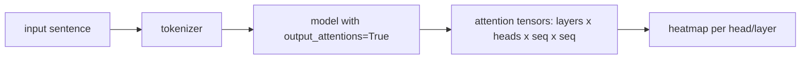

# Mini Project: Attention Visualizer

> **What you'll build:** A tool that runs text through a pretrained transformer,
> pulls out the attention weights, and renders per-head heatmaps so you can *see*
> what the model attends to.

---

## Objective

Attention is famous for being interpretable-ish. You'll test that claim yourself:
extract real attention matrices from a small pretrained model and visualize how
different heads and layers distribute focus across tokens.

## Learning Goals

- Access attention weights from a Hugging Face model.
- Render token×token heatmaps per head and layer.
- Interpret patterns honestly (and their limits).

---

## Prerequisites

- [Multi-Head Attention](../lessons/multi-head-attention.md), [Self-Attention](../lessons/self-attention.md)
- `transformers` + `matplotlib`.

## Architecture

---

## Steps

### 1. Load a model
Use a small model (e.g. `bert-base-uncased` or `distilgpt2`) with
`output_attentions=True`.

### 2. Extract attentions
Tokenize a sentence; run a forward pass; collect the attention tuple (shape
`(layers, batch, heads, seq, seq)`). Map token ids back to readable tokens.

### 3. Visualize
Render heatmaps for selected (layer, head) pairs with token labels on both axes;
build a small grid so you can scan many heads at once.

### 4. Explore patterns
Look for interpretable heads (attending to the previous token, to delimiters, to
matching words) and note heads with no obvious pattern.

### 5. Write up
Summarize what you found — and be honest that attention weights are *suggestive*,
not a full explanation of model behavior (an active research debate).

---

## Deliverables

- [ ] A function `visualize(text, layer, head)` producing a labeled heatmap.
- [ ] A grid figure across several heads/layers for one sentence.
- [ ] `README.md` with figures and an honest interpretation.

## Success Criteria

You can point to at least one head with a clear, describable pattern and correctly
caveat what attention maps do and don't tell you.

---

## Extensions (Optional)

- 🚀 Compare attention on a sentence with a coreference ("The trophy didn't fit
  in the suitcase because it was too big").
- 🚀 Overlay attention on a ViT's image patches instead of text tokens.

## Further Reading

- The Illustrated Transformer — Jay Alammar (https://jalammar.github.io/illustrated-transformer/)
- [Hugging Face documentation](https://huggingface.co/docs)

---

## Navigation

- ⬆️ [Module 6 Mini Projects](README.md)
- 📚 [Module 6 — Transformers](../README.md)
- 🏠 [Knowledge Base Home](../../README.md)
