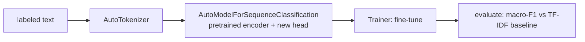

# Mini Project: Fine-Tune a Pretrained Transformer

> **What you'll build:** A fine-tuned encoder transformer (e.g. DistilBERT) that
> classifies text, using the Hugging Face `Trainer` — your first taste of
> transfer learning on transformers.

---

## Objective

Almost nobody trains transformers from scratch; they **fine-tune** pretrained
ones. You'll take a small pretrained encoder, adapt it to a classification task,
and compare it against the classical TF-IDF baseline from Module 5.

## Learning Goals

- Load and fine-tune a pretrained transformer with Hugging Face.
- Handle tokenization, datasets, and the training/eval loop via `Trainer`.
- Quantify the value of pretraining vs a classical baseline.

---

## Prerequisites

- [Architecture Variants](../lessons/architecture-variants.md)
- `transformers` + `datasets`; a labeled text dataset.
- Recommended: a GPU (or a small model + subset for CPU).

## Architecture

Only the classification head is new; the pretrained encoder is adapted.

---

## Steps

### 1. Data
Load a classification dataset (e.g. via `datasets`); make a train/val/test split;
tokenize with the model's `AutoTokenizer` (padding/truncation).

### 2. Model
`AutoModelForSequenceClassification.from_pretrained(...)` with the right
`num_labels`; note the head is randomly initialized.

### 3. Fine-tune
Configure `TrainingArguments` (lr ~2e-5, a few epochs, eval each epoch); train
with `Trainer` and a `compute_metrics` returning macro-F1.

### 4. Compare
Evaluate on the test set; compare against your Module 5 TF-IDF + logistic
regression baseline on the **same** split.

### 5. Write up
Report the accuracy/F1 gain, the compute cost difference, and when the extra cost
is worth it.

---

## Deliverables

- [ ] Fine-tuning script/notebook with tokenization + `Trainer`.
- [ ] Test-set macro-F1 for the transformer and the TF-IDF baseline.
- [ ] `README.md` with results and a cost/benefit discussion.

## Success Criteria

The fine-tuned transformer runs end-to-end and you can state, with numbers on
your split, how much pretraining bought you over the classical baseline.

---

## Extensions (Optional)

- 🚀 Freeze the encoder and train only the head; compare to full fine-tuning
  (previews [PEFT](../../11-fine-tuning/README.md)).
- 🚀 Try a decoder-only model with a classification head and compare.

## Further Reading

- [Hugging Face — fine-tuning docs](https://huggingface.co/docs/transformers/training)
- BERT — Devlin et al., 2018 (https://arxiv.org/abs/1810.04805)

---

## Navigation

- ⬆️ [Module 6 Mini Projects](README.md)
- 📚 [Module 6 — Transformers](../README.md)
- 🏠 [Knowledge Base Home](../../README.md)
