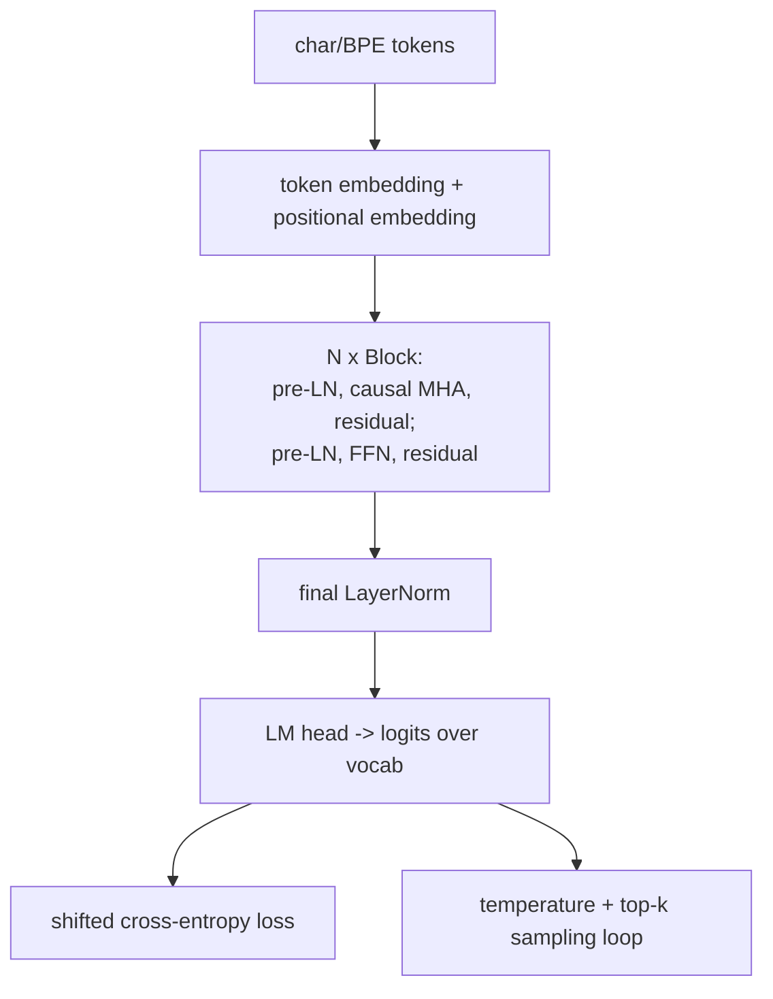

# Portfolio Project: Transformer from Scratch (mini-GPT)

> **What you'll build:** `minigpt` — a complete, tested, documented decoder-only
> transformer implemented from first principles in PyTorch, trained to generate
> text, packaged to the repo's engineering standards. The definitive proof that
> you understand [Module 6](../../06-transformers/README.md).

---

## Objective

The capstone of the transformers module: no `nn.Transformer`, no Hugging Face
model — you write attention, the blocks, the training loop, and generation
yourself, then package it like production software. This is the single most
convincing portfolio artifact for an aspiring LLM engineer.

## Learning Goals

- Implement every transformer component from scratch and verify each.
- Train a language model with the correct objective and generate from it.
- Package research code to production standards (structure, tests, docs).

---

## Prerequisites

- [Module 6 — Transformers](../../06-transformers/README.md) (all lessons).
- [Module 4](../../04-deep-learning/README.md) (PyTorch, training loops) and
  [Module 1](../../01-python-languages/README.md) engineering practices.

## Architecture

---

## Steps

### 1. Scaffold
`src/`-layout package (`pyproject.toml`, `tests/`, config via env/CLI); a `train`
and a `generate` entry point; fixed seeds.

### 2. Components (each tested)
Scaled dot-product attention → causal multi-head attention → position-wise FFN →
pre-LN block → the full model (embeddings → N blocks → final norm → LM head).
Reuse/adapt your Module 6 exercise and assignment code.

### 3. Data & objective
A tokenizer (character-level is fine, or a small BPE); batched `(x, y)` with the
shift-by-one target; cross-entropy over all positions.

### 4. Train
AdamW, gradient clipping, a cosine or warmup schedule, train/val loss logging.
Keep a tiny config that trains on CPU and a larger one documented for GPU.

### 5. Generate
Autoregressive sampling with temperature and top-k; save samples across training
to show progression.

### 6. Quality gates & docs
`pytest` (attention properties, causal mask, block shapes, a tiny overfit test),
`ruff`/`mypy`, CI, and a `README.md` with architecture, config, param count,
loss curves, and generated samples.

---

## Deliverables

- [ ] Installable `minigpt` with `train` + `generate` commands.
- [ ] From-scratch model (no `nn.Transformer` / HF models) with a test suite.
- [ ] Loss curves + generated samples at multiple checkpoints.
- [ ] `README.md` documenting the architecture and results; green CI.

## Success Criteria

A reviewer can install it, train on the toy corpus, and watch generated text go
from noise to structured output — with every component covered by a passing test
and the code clean enough to defend line by line in an interview.

---

## Extensions (Optional)

- 🚀 Add KV-caching to speed up generation and measure the gain.
- 🚀 Swap learned positions for RoPE and compare.
- 🚀 Scale up and reproduce a small published training curve (e.g. on TinyShakespeare).

## Further Reading

- Andrej Karpathy — nanoGPT (https://github.com/karpathy/nanoGPT) & "Let's build GPT" video
- The Annotated Transformer (https://nlp.seas.harvard.edu/annotated-transformer/)
- Attention Is All You Need — Vaswani et al., 2017 (https://arxiv.org/abs/1706.03762)

---

## Navigation

- ⬆️ [Advanced Projects](README.md)
- 🗂️ [Projects](../README.md)
- 📚 [Module 6 — Transformers](../../06-transformers/README.md)
- 🏠 [Knowledge Base Home](../../README.md)
