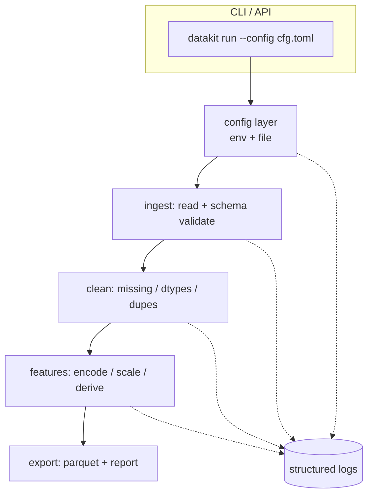

# Portfolio Project: Tabular Data Pipeline Toolkit

> **What you'll build:** `datakit` — a clean, installable Python package with a CLI
> and importable API that turns raw CSVs into validated, model-ready datasets, with
> tests, logging, config, and Docker. A resume-worthy demonstration of everything in
> [Module 1](../../01-python-languages/README.md).

---

## Objective

This is the capstone of Module 1: consolidate the language, data-stack, and
engineering-practice skills into one coherent, production-grade repository you can
show an employer. It mirrors the internal "data preparation" libraries real ML
teams build and maintain.

## Learning Goals

- Ship a clean, installable package with a `src/` layout and `pyproject.toml`.
- Build a leak-safe, testable ingest → clean → feature pipeline.
- Apply production practices: typing, logging, config, tests, CI, Docker.

---

## Prerequisites

- All of [Module 1 — Python for AI Engineering](../../01-python-languages/README.md),
  especially [Project Structure](../../01-python-languages/lessons/project-structure.md),
  [Packaging](../../01-python-languages/lessons/packaging.md),
  [Testing](../../01-python-languages/lessons/testing.md), and
  [Feature Engineering](../../01-python-languages/lessons/feature-engineering.md).
- Docker installed (for the containerization step).

## Architecture

The pipeline is a sequence of **pure, typed transformation functions** orchestrated
by a thin CLI/API. Configuration and logging are cross-cutting concerns injected at
the edges, keeping the core logic testable in isolation.

---

## Steps

### 1. Setup
Scaffold `src/datakit/` with `pyproject.toml`, a virtual environment (uv or Poetry),
`README.md`, `.env.example`, and a `tests/` directory. Make it `pip install -e .`-able
with a `datakit` console entry point.

### 2. Configuration layer
Define a typed settings model (`pydantic-settings`) reading input/output paths, log
level, and feature options from environment variables and/or a `config.toml`. Never
hard-code secrets or paths.

### 3. Ingest + validation
Read CSV/Parquet into a DataFrame and validate it against an expected schema (column
names, dtypes, required fields). Fail fast with clear error messages.

### 4. Clean
Implement pure functions for missing-value handling, dtype coercion, deduplication,
and basic outlier flagging. Each function takes and returns a DataFrame.

### 5. Feature engineering (leak-safe)
Implement scaling and categorical encoding using a scikit-learn `Pipeline` /
`ColumnTransformer` so transforms are **fit on training data only**. Persist the
fitted transformer for reuse at inference.

### 6. Export + report
Write the processed dataset to Parquet and emit a small data-quality report
(row/column counts, missing %, feature list) as JSON and human-readable text.

### 7. Quality gates
Add `pytest` tests (fixtures + `parametrize`) covering each stage, run `mypy` and a
linter, and wire a GitHub Actions workflow that runs them on every push.

### 8. Containerize
Write a `Dockerfile` so `docker run datakit run --config config.toml` executes the
pipeline in a reproducible environment.

---

## Deliverables

- [ ] Installable `datakit` package with CLI + importable API.
- [ ] Leak-safe ingest → clean → features → export pipeline.
- [ ] Typed code, structured logging, env/file configuration.
- [ ] `pytest` suite with meaningful coverage; `mypy` + lint clean.
- [ ] GitHub Actions CI workflow.
- [ ] `Dockerfile` and a polished `README.md` with usage, config, and results.

## Success Criteria

A reviewer can clone the repo, `pip install -e .`, run the CLI on a sample CSV, and
get a validated Parquet dataset plus a report — with green CI and passing tests.
The code is clean enough to defend in an interview.

---

## Extensions (Optional)

- 🚀 Add a `great_expectations`-style validation report.
- 🚀 Publish the package to a private index (see [Packaging](../../01-python-languages/lessons/packaging.md)).
- 🚀 Add a Streamlit UI (previews the future application-development module).

## Further Reading

- [Python Packaging User Guide](https://packaging.python.org/)
- [scikit-learn Pipelines](https://scikit-learn.org/stable/modules/compose.html)

---

## Navigation

- ⬆️ [Beginner Projects](README.md)
- 🗂️ [Projects](../README.md)
- 📚 [Module 1 — Python for AI Engineering](../../01-python-languages/README.md)
- 🏠 [Knowledge Base Home](../../README.md)
