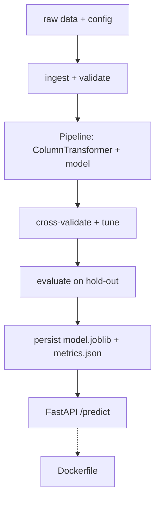

# Portfolio Project: End-to-End ML Pipeline

> **What you'll build:** `ml-pipeline` — a clean, installable project that ingests
> tabular data, trains and evaluates a model through a reproducible scikit-learn
> pipeline, and serves predictions behind a small API, with tests, CI, and Docker.
> A resume-worthy demonstration of [Module 3](../../03-machine-learning/README.md)
> built to [Module 1](../../01-python-languages/README.md) engineering standards.

---

## Objective

This is the capstone of Module 3: turn "I can train a model in a notebook" into "I
can ship a reproducible, tested ML service." It combines ML correctness (no
leakage, honest evaluation) with software engineering (packaging, tests, Docker).

## Learning Goals

- Package an ML project with a clean `src/` layout and config.
- Build a leak-free training pipeline with model selection and honest evaluation.
- Persist a model and serve predictions behind an API, containerized.

---

## Prerequisites

- [Module 3 — Machine Learning](../../03-machine-learning/README.md) (pipelines, CV, metrics).
- [Module 1 — Python for AI Engineering](../../01-python-languages/README.md),
  especially [Project Structure](../../01-python-languages/lessons/project-structure.md),
  [Testing](../../01-python-languages/lessons/testing.md), and
  [Packaging](../../01-python-languages/lessons/packaging.md).

## Architecture

The training and serving code share one preprocessing `Pipeline`, so the exact
transforms used in training are guaranteed at inference — no train/serve skew.

---

## Steps

### 1. Scaffold
Create a `src/`-layout package (`pyproject.toml`, `.env.example`, `tests/`), installable with `pip install -e .`.

### 2. Config & data
Load settings from the environment; ingest a tabular dataset and validate its schema. Hold out a test set once.

### 3. Training pipeline
Build a `Pipeline` + `ColumnTransformer`; select among 2–3 models with **stratified cross-validation** and tune with `GridSearchCV`. No preprocessing outside the pipeline.

### 4. Evaluate & persist
Evaluate on the untouched test set (metrics matching the problem); save `model.joblib` and a `metrics.json` report.

### 5. Serve
Expose a FastAPI `/predict` endpoint that loads the persisted pipeline and returns predictions with input validation.

### 6. Quality gates & Docker
Add `pytest` tests (pipeline + API), `ruff`/`mypy`, a GitHub Actions workflow, and a `Dockerfile` (`docker run` serves the API).

---

## Deliverables

- [ ] Installable `ml-pipeline` package with a training CLI and a serving app.
- [ ] Reproducible, leak-free training pipeline with CV + tuning.
- [ ] Persisted model + `metrics.json`; FastAPI `/predict`.
- [ ] Tests, CI workflow, and a `Dockerfile`.
- [ ] `README.md` with setup, results, and an architecture diagram.

## Success Criteria

A reviewer can clone the repo, train with one command, get a served `/predict`
endpoint via Docker, and see green CI — with evaluation that is honest and
reproducible.

---

## Extensions (Optional)

- 🚀 Add experiment tracking (MLflow) and model versioning.
- 🚀 Add data/prediction drift checks (previews the MLOps module).

## Further Reading

- Hands-On Machine Learning — Aurélien Géron
- [scikit-learn — model persistence](https://scikit-learn.org/stable/model_persistence.html)

---

## Navigation

- ⬆️ [Intermediate Projects](README.md)
- 🗂️ [Projects](../README.md)
- 📚 [Module 3 — Machine Learning](../../03-machine-learning/README.md)
- 🏠 [Knowledge Base Home](../../README.md)
