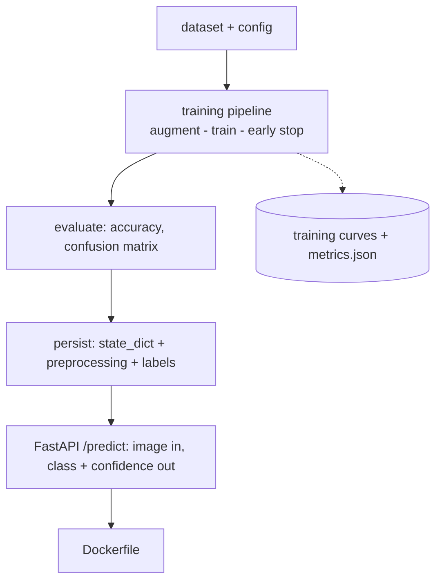

# Portfolio Project: Image Classification Service

> **What you'll build:** `vision-service` — a trained, regularized CNN packaged
> into an installable project and served behind a FastAPI endpoint in Docker,
> with honest evaluation, tests, and CI. The deep-learning counterpart to the
> [End-to-End ML Pipeline](end-to-end-ml-pipeline.md).

---

## Objective

The capstone of [Module 4](../../04-deep-learning/README.md): demonstrate that
you can take a neural network from training notebook to a reproducible,
containerized inference service — the workflow behind every production vision
system.

## Learning Goals

- Train a CNN with a correct, regularized training pipeline and honest metrics.
- Package model + preprocessing so training and serving can't drift apart.
- Ship an inference API with input validation, tests, and Docker.

---

## Prerequisites

- [Module 4 — Deep Learning](../../04-deep-learning/README.md) (CNNs, PyTorch, training techniques).
- [Module 1](../../01-python-languages/README.md) engineering practices
  (packaging, testing, logging, config).

## Architecture

Preprocessing (resize/normalize) is defined **once** and reused by both the
training pipeline and the serving path — eliminating train/serve skew.

---

## Steps

### 1. Scaffold
`src/`-layout package (`pyproject.toml`, `.env.example`, `tests/`), a `train` CLI
and a `serve` entry point.

### 2. Train
FashionMNIST or CIFAR-10 via `torchvision`; CNN with dropout + augmentation;
AdamW + schedule; early stopping on validation; fixed seeds. Save `state_dict`,
label mapping, and preprocessing config together.

### 3. Evaluate
One-time test-set evaluation: accuracy, per-class metrics, confusion matrix,
and a small gallery of failures written to `metrics.json` + `README`.

### 4. Serve
FastAPI endpoint that accepts an image upload, applies the *same* preprocessing,
and returns top-k classes with confidences; reject invalid inputs cleanly;
`model.eval()` + `torch.no_grad()` throughout.

### 5. Quality gates & Docker
`pytest` (model loading, preprocessing parity, API contract), `ruff`/`mypy`,
GitHub Actions CI, and a `Dockerfile` (CPU inference) so
`docker run vision-service` serves predictions.

---

## Deliverables

- [ ] Training CLI producing model artifact + metrics report.
- [ ] Served `/predict` endpoint with validation and top-k output.
- [ ] Tests incl. a preprocessing train/serve parity test; green CI.
- [ ] `Dockerfile`; `README.md` with architecture, curves, results, and usage.

## Success Criteria

A reviewer can train with one command, `docker run` the service, POST an image,
and get a sensible prediction — with reproducible metrics and passing CI behind it.

---

## Extensions (Optional)

- 🚀 Fine-tune a pretrained `torchvision` backbone and compare (transfer learning).
- 🚀 Export to ONNX and benchmark CPU inference latency.

## Further Reading

- [PyTorch tutorials](https://pytorch.org/tutorials/)
- [FastAPI documentation](https://fastapi.tiangolo.com/)

---

## Navigation

- ⬆️ [Intermediate Projects](README.md)
- 🗂️ [Projects](../README.md)
- 📚 [Module 4 — Deep Learning](../../04-deep-learning/README.md)
- 🏠 [Knowledge Base Home](../../README.md)
