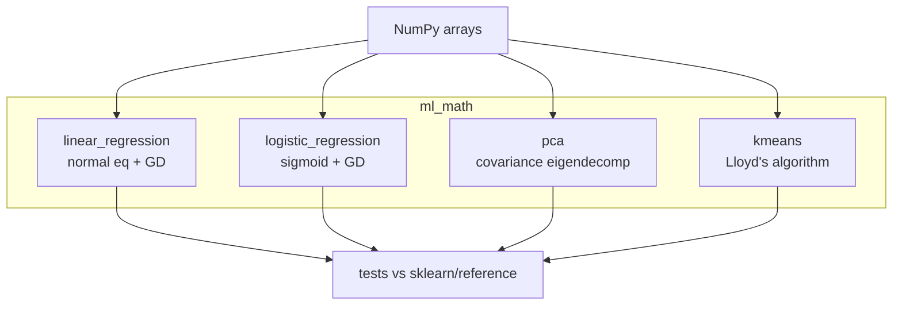

# Portfolio Project: ML Math From Scratch

> **What you'll build:** `ml-math` — a small, tested library implementing the
> foundational ML algorithms **from the mathematics up** with only NumPy: linear
> regression, logistic regression, PCA, and k-means. A portfolio piece that proves
> you understand what the frameworks do under the hood.

---

## Objective

This is the capstone of Module 2: turn the linear algebra, calculus, probability,
and optimization you learned into working algorithms — no `scikit-learn`. It
demonstrates genuine mathematical depth, which interviewers probe for.

## Learning Goals

- Derive and implement gradient-based and closed-form learning algorithms.
- Apply eigendecomposition (PCA) and iterative clustering (k-means).
- Validate correctness against reference implementations and with tests.

---

## Prerequisites

- All of [Module 2 — Mathematics for AI](../../02-mathematics-foundations/README.md).
- Comfortable with [NumPy](../../01-python-languages/lessons/numpy.md).

## Architecture

Each algorithm is a small, typed module with a consistent `fit` / `predict` (or
`transform`) API and its own tests.

---

## Steps

### 1. Setup
Scaffold an installable `src/`-layout package `ml_math` with `pyproject.toml`,
tests, and a README. NumPy + Matplotlib + pytest only.

### 2. Linear regression
Implement both the normal equation and gradient descent (reuse your
[Module 2 assignment](../../02-mathematics-foundations/assignments/linear-regression-from-scratch.md)).
Include the gradient derivation in the docs.

### 3. Logistic regression
Implement the sigmoid, binary cross-entropy loss, and its gradient; train with
gradient descent. Explain the link to [Information Theory](../../02-mathematics-foundations/lessons/information-theory.md).

### 4. PCA
Implement PCA via covariance eigendecomposition (`np.linalg.eigh`) with an
`explained_variance_ratio_`.

### 5. k-means
Implement Lloyd's algorithm (assign → update) with k-means++ initialization and a
convergence check.

### 6. Validate & document
For each algorithm, add tests comparing against a trusted reference (a `sklearn`
result **in the tests only**, or a hand-derived expected value) within tolerance.
Add small demo plots and a polished README.

---

## Deliverables

- [ ] Installable `ml_math` package with 4 algorithms sharing a clean API.
- [ ] Gradient derivations documented for the two regressions.
- [ ] `pytest` suite validating each algorithm against a reference.
- [ ] Demo notebook/script with plots.
- [ ] `README.md` with math, usage, and results.

## Success Criteria

Each algorithm matches a reference implementation within tolerance on test data,
tests pass, and the README clearly explains the math behind each method.

---

## Extensions (Optional)

- 🚀 Add ridge/lasso (L2/L1) regularization and show the effect.
- 🚀 Add an SVD-based PCA and compare to the eigendecomposition version.
- 🚀 Package it and publish to a private index.

## Further Reading

- Mathematics for Machine Learning — Deisenroth, Faisal & Ong (https://mml-book.github.io/)
- Related domain: [Machine Learning](../../03-machine-learning/README.md)

---

## Navigation

- ⬆️ [Intermediate Projects](README.md)
- 🗂️ [Projects](../README.md)
- 📚 [Module 2 — Mathematics for AI](../../02-mathematics-foundations/README.md)
- 🏠 [Knowledge Base Home](../../README.md)
