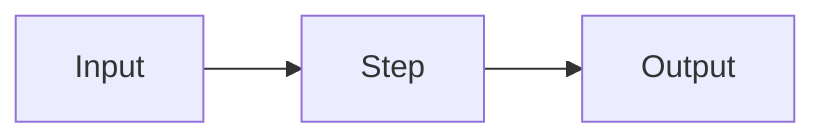

# <Lesson Title>

> **TL;DR:** <One or two sentences a reader can walk away with.>

---

## Overview

<What this lesson covers and why it matters. Set context in 2–4 sentences.>

**By the end, you will be able to:**

- <Learning objective 1>
- <Learning objective 2>
- <Learning objective 3>

---

## Intuition

<Explain the core idea in plain language first — an analogy or mental model
before any formalism.>

---

## Details

<The substance: definitions, mechanics, math, and how it actually works.
Introduce symbols before using them.>

```python
# Minimal, runnable example
```

---

## Worked Example

<Step through a concrete example end-to-end.>

---

## Diagram

<Optional. A Mermaid diagram of the concept's flow or architecture.>



---

## Best Practices

- ✅ <Recommended practice>
- ✅ <Recommended practice>

## Common Mistakes

- ⚠️ <Mistake and how to avoid it>
- ⚠️ <Mistake and how to avoid it>

## Industry Tips

- 💡 <How this is used / done well in production>

---

## Real-World Use Cases

- <Where this shows up in real AI engineering work>

---

## Summary

- <Key point 1>
- <Key point 2>
- <Key point 3>

---

## Practice

- [ ] Related exercise: [<exercise>](./<exercise>.md)
- [ ] Self-check question: <question>

---

## Further Reading

- [<Source title>](<url>) — <why it's useful>
- Related notes: [[<related-note>]]

---

## Navigation

- ⬆️ [<Parent section>](README.md)
- 🏠 [Knowledge Base Home](../../README.md)
