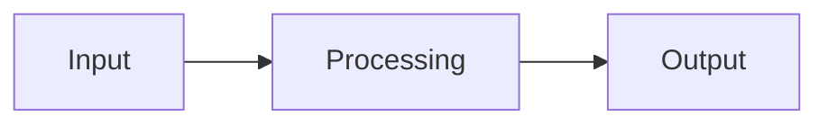

# <Project Title>

> **What you'll build:** <One-line description of the finished artifact.>

---

## Objective

<What the project accomplishes and the real-world problem it maps to.>

## Learning Goals

- <Skill / concept 1 reinforced>
- <Skill / concept 2 reinforced>

---

## Prerequisites

- <Knowledge needed>
- <Tools / accounts needed>

## Architecture

<Describe the components and how they fit together.>

---

## Steps

### 1. Setup
<Environment, dependencies, scaffolding.>

### 2. <Build step>
<Instructions.>

### 3. <Build step>
<Instructions.>

### 4. Test & Validate
<How to confirm it works.>

---

## Deliverables

- [ ] <Artifact 1 (e.g., working script / app)>
- [ ] <Artifact 2 (e.g., README with results)>
- [ ] <Artifact 3 (e.g., short write-up)>

## Success Criteria

<How the learner knows the project meets the bar.>

---

## Extensions (Optional)

- 🚀 <Stretch goal 1>
- 🚀 <Stretch goal 2>

## Further Reading

- [<Source>](<url>)

---

## Navigation

- ⬆️ [Projects](../README.md)
- 🏠 [Knowledge Base Home](../../README.md)
